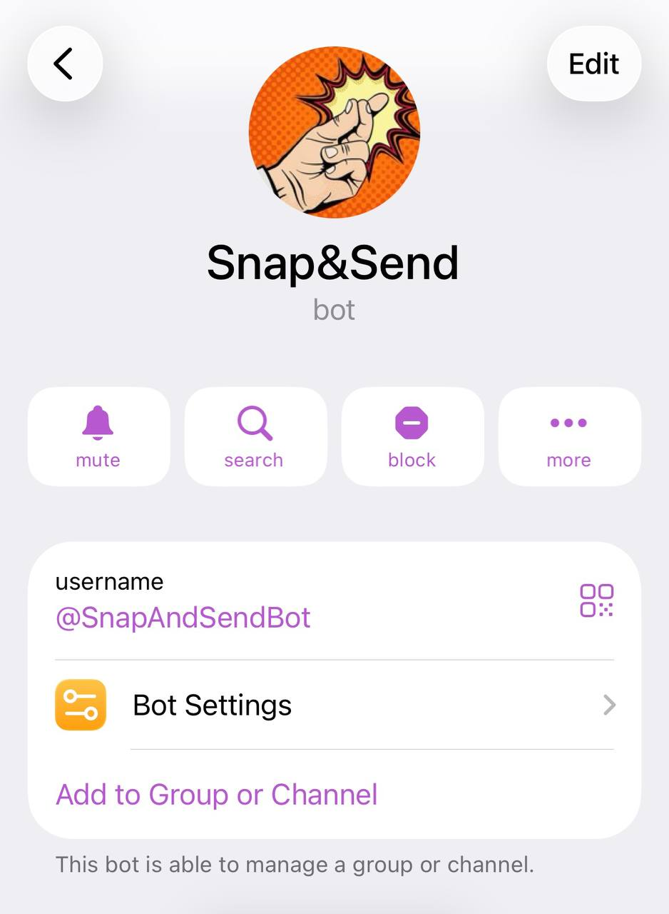
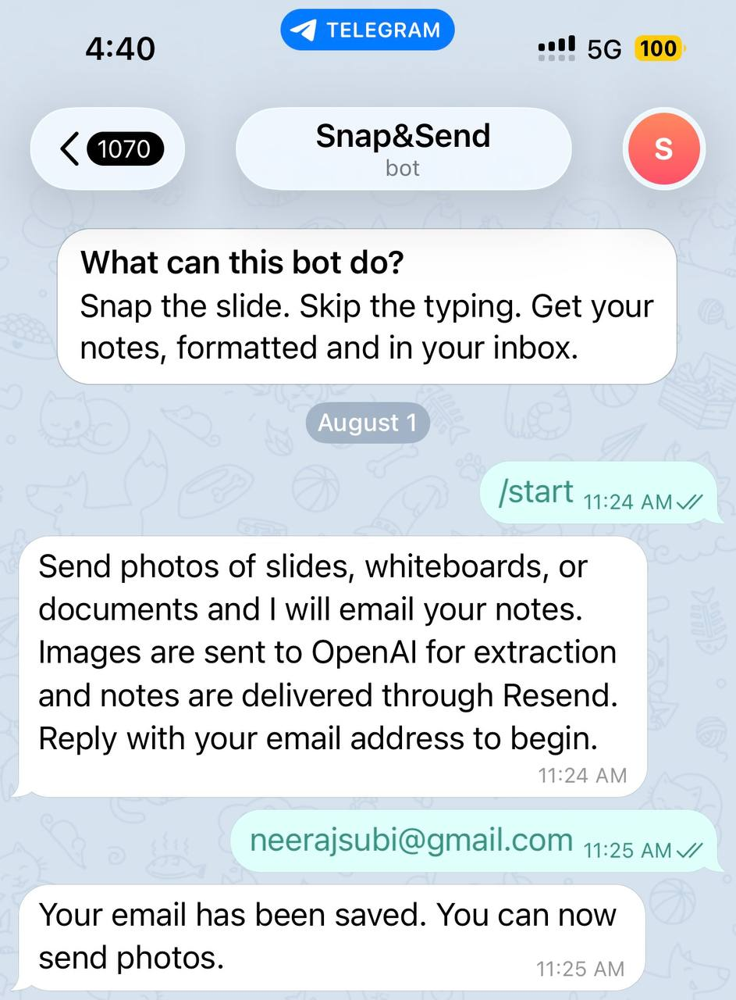
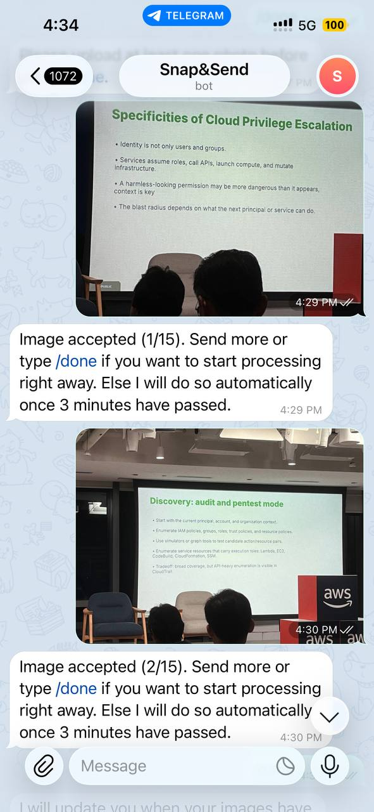
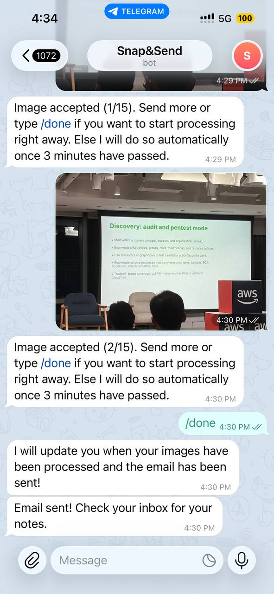
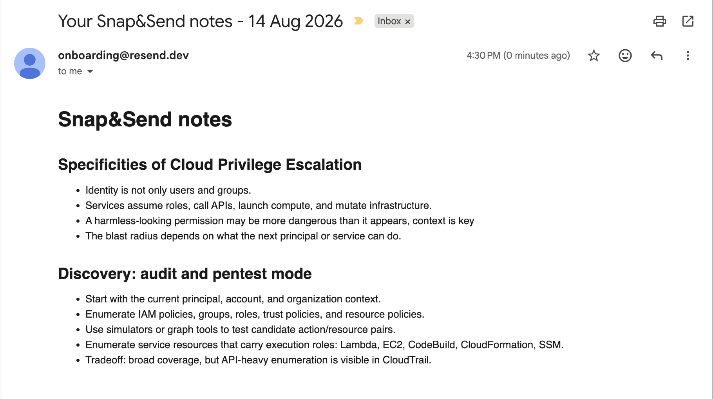
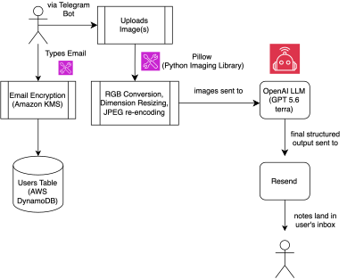

# Snap&Send

## Table of Contents

1. [What is Snap&Send?](#what-is-snapsend)
2. [Try out Snap&Send](#try-out-snapsend)
3. [How Snap&Send Works](#how-snapsend-works)
4. [Product Walkthrough](#product-walkthrough)
5. [Privacy & Security](#privacy--security)
6. [Tech Stack Used](#tech-stack-used)
7. [Why these Technologies?](#why-these-technologies)
8. [System Architecture Diagram](#system-architecture-diagram)
9. [Key Decisions Made](#key-decisions-made)
10. [Evaluations](#evaluations)
11. View PRD

## What is Snap&Send?

Snap&Send is a Telegram bot for people who frequent conferences & networking
events. Many take photos of presenter slides but never look at them again.
As a result, the knowledge gained from the event gets lost.

## Try out Snap&Send

Search `@SnapAndSendBot` in Telegram.

## How Snap&Send Works

Send it photos whenever u capture them at an event & never feel the need to
manually take notes when you are on the go during the event or after the
event.

Snap&Send bot extracts the visible text, preserving whatever structure is
actually on the page: headings, paragraphs, bullet lists, tables, and
flowcharts.

It combines everything from a batch of photos sent into one set of notes and
emails it to you almost immediately.

By the time you're back at the laptop, the notes are already in your inbox, ready to file away wherever you keep them.

## Product Walkthrough

### Starting a conversation

*The bot's onboarding message after /start, followed by email registration.*

Sending `/start` shows what the bot does, discloses that photos are sent to
OpenAI for extraction and notes are delivered through Resend, and asks for
an email address. Reply with a valid email address and the bot confirms it
is saved. Photos can be sent right after.

### Sending photos and getting a response

*Each photo is acknowledged with a running count, and /done triggers
processing right away.*

Every accepted photo gets an immediate reply with a running count, for
example "Image accepted (2/15)". A batch holds a maximum of 15 photos.
Sending `/done` starts processing right away instead of waiting for the
3-minute inactivity window to close the batch automatically. The bot
replies once to confirm it is processing, then again once the email has
been sent.

### The emailed notes

*The final email: one heading per photo, with the extracted content kept in
its original structure.*

Once processing finishes, one email arrives with all of the batch's content
combined, in the order the photos were sent.

## Privacy & Security

- **Emails are encrypted at rest.** Registered addresses are encrypted with
  AWS KMS before being written to the database, using a per-user encryption
  context so one user's ciphertext cannot be decrypted in another user's
  context.

## Tech Stack Used

| Layer               | Technology                                  |
| -------------------- | -------------------------------------------- |
| Language & Runtime    | Python 3.12                                  |
| Bot Framework         | python-telegram-bot (async, long-polling)    |
| LLM                   | OpenAI (structured output, gpt-5.6-terra)    |
| Database              | AWS DynamoDB                                 |
| Email Encryption      | AWS KMS                                      |
| Email Delivery        | Resend                                       |
| Image Processing      | Pillow                                       |
| LLM Observability     | Langfuse                                     |
| Hosting               | Railway                                      |

## Why these Technologies?

- **Python 3.12.** Strong async support for a pipeline that is mostly
  waiting on network calls (Telegram, OpenAI, DynamoDB, KMS, Resend), and a
  mature ecosystem for every one of those integrations.
- **python-telegram-bot, long-polling.** A well-maintained async wrapper
  around the Telegram Bot API. Long-polling means the bot only needs to
  make outbound connections, so it never needs a public HTTPS endpoint,
  TLS certificate, or webhook registration to run, which keeps both local
  development and deployment simple for a single-instance v1.
- **OpenAI, structured output.** The model needs to read photographed
  slides and whiteboards, so a vision-capable model is required either way.
  Structured output (a strict JSON schema) means every response comes back
  as typed, predictable content blocks instead of free text that would
  need fragile parsing, and it is what makes preserving the source's real
  structure (headings, bullets, tables, flowcharts) possible at all.
- **AWS DynamoDB.** The app only ever needs one simple lookup: a user's
  record by their Telegram ID. On-demand billing avoids provisioning
  capacity for unpredictable, low-volume traffic, and it is fully managed,
  so there is no database server to run or patch.
- **AWS KMS.** Used to encrypt registered emails before they are written to
  DynamoDB. A managed key service means the encryption keys themselves are
  never something the app has to generate, store, or rotate.
- **Resend.** A straightforward transactional email API with a simple
  domain verification flow and support for sending both an HTML and a
  plain-text body in one request.
- **Pillow.** The standard, mature Python imaging library, used to resize
  and compress photos entirely in memory before they are sent to OpenAI.
- **Langfuse.** Purpose-built for tracing LLM calls specifically, not a
  generic APM tool. It wraps the OpenAI client directly, so extraction and
  curation calls are traced automatically, giving per-call visibility into
  latency, token usage, and cost.
- **Railway.** Runs the bot as a single, always-on process, which is what
  long-polling requires, without needing to manage servers or containers
  directly.

## System Architecture Diagram

## Key Decisions Made

- **Notes are delivered by email, not inside the Telegram chat.** Most
  people check their email every day. Notes landing there are easy to find
  later, and can be copy-pasted straight into whatever notes tool someone
  already uses, whether that is Notion, Google Docs, or a plain notes app,
  instead of being locked into Telegram.
- **Email also gives a better experience overall.** Sending extracted text
  back inside the Telegram chat would clutter the conversation with long
  blocks of text. It also assumes the user has Telegram installed on their
  laptop, which is not always true, while checking email on a laptop is
  close to universal.

## Evaluations

Tested on 20 different images, a mix of handwritten notes, posters, and
slide images.

| Metric             | Result                | What it measures                                                    |
| ------------------- | ---------------------- | --------------------------------------------------------------------- |
| Fabrication Rate    | 2.50% (lower is better) | Whether the output text was exactly what was visible in the image    |
| Completeness        | 98.64%                 | Whether all visible text in the image was extracted                  |
| Average Latency     | 14.812s                | Round trip from message sent to email received, across all 20 images |
| Average Cost        | $0.04 per image         | -                                                                     |

Latency and cost were measured through Langfuse.

### Pass^k

When a prompt change was made to correct an issue surfaced during testing,
Pass^k was used to check that the fix actually held up rather than just
happening to work once. Pass^k estimates the probability that the model
succeeds on all k independent attempts at the same input, which is useful
for evaluating consistency and reliability, not just correctness on a
single run. k = 3 to 5 was used to check for consistency.

### Further reading

- [AI Evals Doc](https://docs.google.com/spreadsheets/d/1ITmXxpbtGjXEHDbZ_ZPcPFOKRDlK0IoAr-u3scMrA9A/edit?usp=sharing)
- [LLM Extractions for all test images](https://docs.google.com/document/d/1QmGhdIwU1ksg0tkFloPS2Xsil3kkWQcB-Xkvf9atuBg/edit?usp=drive_link)
